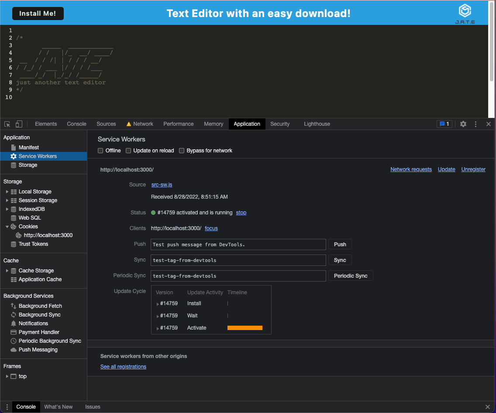
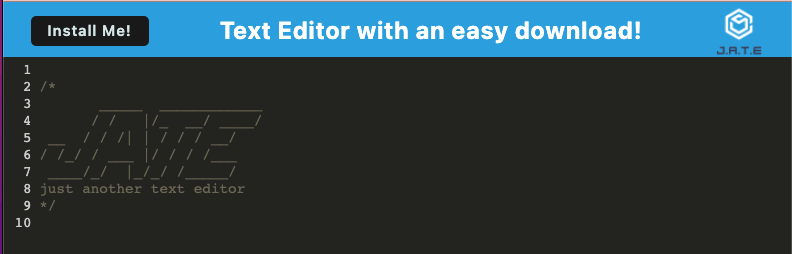

# TextEditor


## Table of Contents

- [Description](#description)
- [Installation](#installation)
- [Usage](#usage)
- [Screenshots](#screenshots)
- [Technologies Used](#technologies-used)
- [Questions](#questions)
- [License](#license)

## Description

Progressive Web Application(PWA) that edits text online and offline. Button allows for user to download application.

<br>

## Installation

[Node.js](https://nodejs.org/en/) installation required. Clone my repo and follow usage commands or download the application by clicking "Install Me1" button.

## Usage

This application can be used locally by opening localhost:3000-

[Node.js](https://nodejs.org/en/) installation is required. Clone repo and follow usage commands.

<br>

## Usage

Install dependencies:

```
npm i
```

<br>

Start the application/run the port:

```
npm start
```

<br>
## Screenshots

 
<br>


## Technologies Used

- [Node.js](https://nodejs.org/en/)
- [Nodemon](https://www.npmjs.com/package/nodemon)
- [Express](https://expressjs.com/)
- [Webpack](https://webpack.js.org/)
- [Babel](https://babeljs.io/)
- [Concurrently](https://www.npmjs.com/package/concurrently)

## Questions

Contact me here:

<a href="mailto: anacecyflores1@gmail.com"></a><a href="https://www.linkedin.com/in/anacecyflores/"></a><a href="https://cecy-professional-portfolio.herokuapp.com/" target="_blank"></a>

## License

Copyright (c) 2022 Ana Cecy Flores

Licensed under the [MIT](LICENSE) license.
